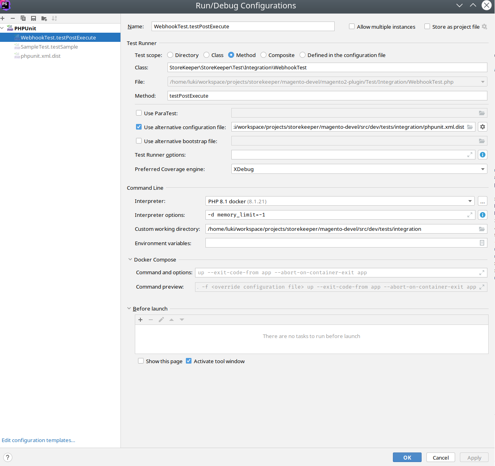

Install magento
--

Generate public and private keys according to [Magento Installation Guide](https://experienceleague.adobe.com/en/docs/commerce-operations/installation-guide/prerequisites/authentication-keys)  

Open file env/magento.env and set values for variables **MAGENTO_PUBLIC** and **MAGENTO_PRIVATE** according to data from previous step  

Edit variable **META_VERSION** according to desired Magento version (i.e. 2.4.6-p4)

```bash 
docker compose run app bash

source env/blackfire.env  
source env/db.env  
source env/elasticsearch.env  
source env/magento.env  
source env/opensearch.env  
source env/phpfpm.env  
source env/rabbitmq.env  
source env/redis.env

composer config --global http-basic.repo.magento.com "$MAGENTO_PUBLIC" "$MAGENTO_PRIVATE"
composer create-project --repository-url=https://repo.magento.com/ \
     "${META_PACKAGE}" /tmp/exampleproject "${META_VERSION}"

cp /tmp/exampleproject/* /var/www/html/
 rm -rf /tmp/exampleproject/

composer config --no-plugins allow-plugins.magento/magento-composer-installer true
composer config --no-plugins allow-plugins.magento/inventory-composer-installer true
composer config --no-plugins allow-plugins.laminas/laminas-dependency-plugin true

bin/magento setup:install \
  --db-host="$MYSQL_HOST" \
  --db-name="$MYSQL_DATABASE" \
  --db-user="$MYSQL_USER" \
  --db-password="$MYSQL_PASSWORD" \
  --base-url=http://localhost:9442/ \
  --base-url-secure=https://localhost:9442/ \
  --backend-frontname="$MAGENTO_ADMIN_FRONTNAME" \
  --admin-firstname="$MAGENTO_ADMIN_FIRST_NAME" \
  --admin-lastname="$MAGENTO_ADMIN_LAST_NAME" \
  --admin-email="$MAGENTO_ADMIN_EMAIL" \
  --admin-user="$MAGENTO_ADMIN_USER" \
  --admin-password="$MAGENTO_ADMIN_PASSWORD" \
  --language="$MAGENTO_LOCALE" \
  --currency="$MAGENTO_CURRENCY" \
  --timezone="$MAGENTO_TIMEZONE" \
  --amqp-host="$RABBITMQ_HOST" \
  --amqp-port="$RABBITMQ_PORT" \
  --amqp-user="$RABBITMQ_DEFAULT_USER" \
  --amqp-password="$RABBITMQ_DEFAULT_PASS" \
  --amqp-virtualhost="$RABBITMQ_DEFAULT_VHOST" \
  --cache-backend=redis \
  --cache-backend-redis-server="$REDIS_CACHE_BACKEND_SERVER" \
  --cache-backend-redis-db="$REDIS_CACHE_BACKEND_DB" \
  --page-cache=redis \
  --page-cache-redis-server="$REDIS_PAGE_CACHE_SERVER" \
  --page-cache-redis-db="$REDIS_PAGE_CACHE_DB" \
  --session-save=redis \
  --session-save-redis-host="$REDIS_SESSION_SAVE_HOST" \
  --session-save-redis-log-level=4 \
  --session-save-redis-db=2 \
  --elasticsearch-host="$ES_HOST" \
  --elasticsearch-port="$ES_PORT" \
  --opensearch-host="$OPENSEARCH_HOST" \
  --opensearch-port="$OPENSEARCH_PORT" \
  --search-engine=opensearch \
  --use-rewrites=1 \
  --no-interaction

composer require markshust/magento2-module-disabletwofactorauth
bin/magento module:enable MarkShust_DisableTwoFactorAuth
bin/magento setup:upgrade
bin/magento config:set twofactorauth/general/enable 0
```


Changing root magento url to external provider by cloudflare
--

Services like cloudflare zero conf tunnel can be used can be used. https://developers.cloudflare.com/cloudflare-one/connections/connect-apps/

```bash 
export ROOT_URL=https://luki-magento.code4.pizza/ 
bin/magento config:set web/unsecure/base_url $ROOT_URL &&\
bin/magento config:set web/secure/base_url $ROOT_URL &&\
bin/magento cache:flush &&\
bin/magento setup:di:compile

```


Installing plugin
---

Add `/var/www/html/magento2-plugin/` repo to `src/composer.json`
```json
    "repositories": [
        ...,
        {
            "type": "path",
            "url": "/var/www/html/magento2-plugin/"
        }
    ],
```

```bash
composer require "storekeeper/magento2-plugin @dev" &&\
bin/magento setup:upgrade &&\
bin/magento setup:di:compile &&\
bin/magento setup:static-content:deploy &&\
bin/magento cache:clean
```

Prepare integration tests
---

Based on adobe manual: https://developer.adobe.com/commerce/testing/guide/integration/#prepare-integration-test-execution

```bash
docker compose run db bash

# If database doesn't exist, create it and add user permissions
mysql -h"${MYSQL_INTEGRATION_HOST}" -uroot -p"${MYSQL_ROOT_PASSWORD}" "${MYSQL_INTEGRATION_DATABASE}" -e exit &> /dev/null ||
  mysqladmin -h"${MYSQL_INTEGRATION_HOST}" -uroot -p"${MYSQL_ROOT_PASSWORD}" create "${MYSQL_INTEGRATION_DATABASE}" &&
  echo "Database ${MYSQL_INTEGRATION_DATABASE} created." &&
  mysql -uroot -p"${MYSQL_ROOT_PASSWORD}" -h"${MYSQL_INTEGRATION_HOST}" \
    -e "GRANT ALL PRIVILEGES ON ${MYSQL_INTEGRATION_DATABASE}.* TO '${MYSQL_INTEGRATION_USER}'@'%';FLUSH PRIVILEGES;"

```
```bash
cp template/dev/tests/integration/etc/install-config-mysql.php src/dev/tests/integration/etc/install-config-mysql.php

docker compose run app bash
bin/magento module:enable Magento_AdminAdobeImsTwoFactorAuth 
bin/magento module:enable Magento_TwoFactorAuth 
```

Run integration tests
--

```bash

docker compose run app bash
cd /var/www/html/dev/tests/integration
../../../vendor/bin/phpunit /var/www/html/magento2-plugin/Test/Integration/
```

Run unit tests
--

```bash

docker compose run app bash
cd /var/www/html/dev/tests/unit
../../../vendor/bin/phpunit /var/www/html/magento2-plugin/Test/Unit/
```

Debugging unit tests with PHPStorm
-- 

Based on https://developer.adobe.com/commerce/testing/guide/unit/phpstorm/ and https://developer.adobe.com/commerce/testing/guide/integration/#run-integration-tests-in-phpstorm

Unit tests 
---

1. Add the docker interpretter 
2. Add test framework 
3. Create configuration 

Integration tests
---




Error: Allowed memory size of 134217728 bytes exhausted
---

If you get error `Fatal error: Allowed memory size of 134217728 bytes exhausted (tried to allocate 20480 bytes) in /var/www/html/vendor/magento/framework/Setup/Declaration/Schema/Diff/SchemaDiff.php on line 76`

Add `-d memory_limit=-1` to part of `src/dev/tests/integration/framework/Magento/TestFramework/Application.php` line 562
From 
```php
        // run install script
        $this->_shell->execute(
            PHP_BINARY . ' -d memory_limit=-1 -f %s setup:install -vvv ' . implode(' ', array_keys($installParams)),
            array_merge([BP . '/bin/magento'], array_values($installParams))
        );
```
To
```php
        // run install script
        $this->_shell->execute(
            PHP_BINARY . ' -f %s setup:install -vvv ' . implode(' ', array_keys($installParams)),
            array_merge([BP . '/bin/magento'], array_values($installParams))
        );
```

Speed up tests 
---

see: https://developer.adobe.com/commerce/testing/guide/integration/#tests_cleanup-constant

In src/dev/tests/integration/phpunit.xml.dist change to `<const name="TESTS_CLEANUP" value="disabled"/>`
