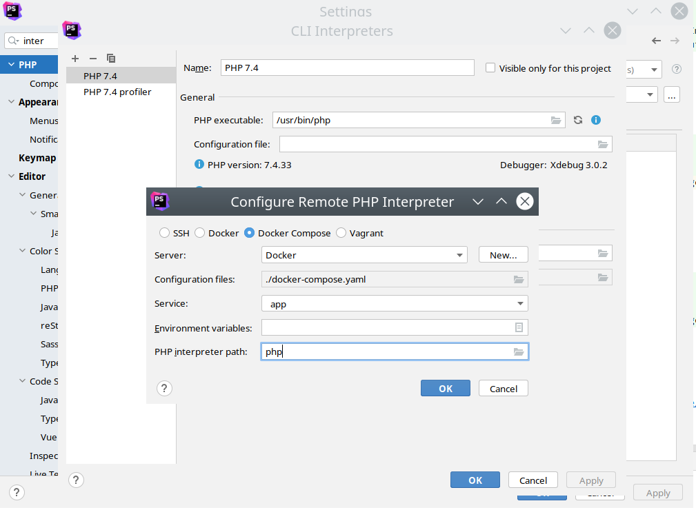

Install magento
--

```bash 
docker-compose run app bash

composer config --global http-basic.repo.magento.com 2cb7731c52c5142a6351fe1a3bfbf013 ea82d7f9604d09ca41cd2ea9264f1f71
composer create-project --repository=https://repo.magento.com/ magento/project-community-edition=2.4.6-p1 .

composer config --no-plugins allow-plugins.magento/magento-composer-installer true
composer config --no-plugins allow-plugins.magento/inventory-composer-installer true
composer config --no-plugins allow-plugins.laminas/laminas-dependency-plugin true


source env/blackfire.env  
source env/db.env  
source env/elasticsearch.env  
source env/magento.env  
source env/opensearch.env  
source env/phpfpm.env  
source env/rabbitmq.env  
source env/redis.env

bin/magento setup:install \
  --db-host="$MYSQL_HOST" \
  --db-name="$MYSQL_DATABASE" \
  --db-user="$MYSQL_USER" \
  --db-password="$MYSQL_PASSWORD" \
  --base-url=http://localhost:9442/ \
  --base-url-secure=http://localhost:9442/ \
  --backend-frontname="$MAGENTO_ADMIN_FRONTNAME" \
  --admin-firstname="$MAGENTO_ADMIN_FIRST_NAME" \
  --admin-lastname="$MAGENTO_ADMIN_LAST_NAME" \
  --admin-email="$MAGENTO_ADMIN_EMAIL" \
  --admin-user="$MAGENTO_ADMIN_USER" \
  --admin-password="$MAGENTO_ADMIN_PASSWORD" \
  --language="$MAGENTO_LOCALE" \
  --currency="$MAGENTO_CURRENCY" \
  --timezone="$MAGENTO_TIMEZONE" \
  --amqp-host="$RABBITMQ_HOST" \
  --amqp-port="$RABBITMQ_PORT" \
  --amqp-user="$RABBITMQ_DEFAULT_USER" \
  --amqp-password="$RABBITMQ_DEFAULT_PASS" \
  --amqp-virtualhost="$RABBITMQ_DEFAULT_VHOST" \
  --cache-backend=redis \
  --cache-backend-redis-server="$REDIS_CACHE_BACKEND_SERVER" \
  --cache-backend-redis-db="$REDIS_CACHE_BACKEND_DB" \
  --page-cache=redis \
  --page-cache-redis-server="$REDIS_PAGE_CACHE_SERVER" \
  --page-cache-redis-db="$REDIS_PAGE_CACHE_DB" \
  --session-save=redis \
  --session-save-redis-host="$REDIS_SESSION_SAVE_HOST" \
  --session-save-redis-log-level=4 \
  --session-save-redis-db=2 \
  --elasticsearch-host="$ES_HOST" \
  --elasticsearch-port="$ES_PORT" \
  --opensearch-host="$OPENSEARCH_HOST" \
  --opensearch-port="$OPENSEARCH_PORT" \
  --search-engine=opensearch \
  --use-rewrites=1 \
  --no-interaction

bin/magento module:disable Magento_AdminAdobeImsTwoFactorAuth 
bin/magento module:disable Magento_TwoFactorAuth 
```


Changing root magento url
--

```bash 
ROOT_URL=http://localhost:9442/
bin/magento config:set web/unsecure/base_url $ROOT_URL
bin/magento config:set web/secure/base_url $ROOT_URL
bin/magento cache:flush
bin/magento setup:di:compile

```


Installing plugin
---

Add `/var/www/html/magento2-plugin/` repo to `src/composer.json`
```json
    "repositories": [
        ...,
        {
            "type": "path",
            "url": "/var/www/html/magento2-plugin/"
        }
    ],
```

```bash
composer require "storekeeper/magento2-plugin @dev" &&\
bin/magento setup:upgrade &&\
bin/magento setup:di:compile &&\
bin/magento setup:static-content:deploy &&\
bin/magento cache:clean
```

Prepare integration tests
---

Based on adobe manual: https://developer.adobe.com/commerce/testing/guide/integration/#prepare-integration-test-execution

```bash
docker-compose run db bash

# If database doesn't exist, create it and add user permissions
mysql -h"${MYSQL_INTEGRATION_HOST}" -uroot -p"${MYSQL_ROOT_PASSWORD}" "${MYSQL_INTEGRATION_DATABASE}" -e exit &> /dev/null ||
  mysqladmin -h"${MYSQL_INTEGRATION_HOST}" -uroot -p"${MYSQL_ROOT_PASSWORD}" create "${MYSQL_INTEGRATION_DATABASE}" &&
  echo "Database ${MYSQL_INTEGRATION_DATABASE} created." &&
  mysql -uroot -p"${MYSQL_ROOT_PASSWORD}" -h"${MYSQL_INTEGRATION_HOST}" \
    -e "GRANT ALL PRIVILEGES ON ${MYSQL_INTEGRATION_DATABASE}.* TO '${MYSQL_INTEGRATION_USER}'@'%';FLUSH PRIVILEGES;"

```
```bash
cp template/dev/tests/integration/etc/install-config-mysql.php src/dev/tests/integration/etc/install-config-mysql.php

docker-compose run app bash
bin/magento module:enable Magento_AdminAdobeImsTwoFactorAuth 
bin/magento module:enable Magento_TwoFactorAuth 
```

Run integration tests
--

```bash

docker-compose run app bash
cd /var/www/html/dev/tests/integration
../../../vendor/bin/phpunit /var/www/html/magento2-plugin/Test/Integration/
```

Run unit tests
--

```bash

docker-compose run app bash
cd /var/www/html/dev/tests/unit
../../../vendor/bin/phpunit /var/www/html/magento2-plugin/Test/Unit/
```

Debugging unit tests with PHPStorm
-- 

Based on https://developer.adobe.com/commerce/testing/guide/unit/phpstorm/ and https://developer.adobe.com/commerce/testing/guide/integration/#run-integration-tests-in-phpstorm

Unit tests 
---

1. Add the docker interpretter 
2. Add test framework 
3. Create configuration 

Integraton tests
---


-> now broken with Fatal error: Allowed memory size of 134217728 bytes exhausted (tried to allocate 20480 bytes) in /var/www/html/vendor/magento/framework/Setup/Declaration/Schema/Diff/SchemaDiff.php on line 76 for some reason
